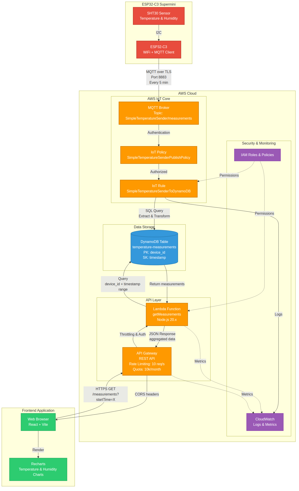
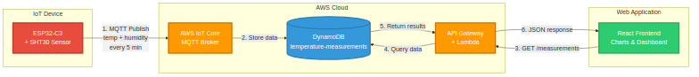

# Dokumentaatio

Tämä hakemisto sisältää projektin arkkitehtuurikaaviot ja dokumentaation.

## Arkkitehtuurikaaviot

### Yksityiskohtainen arkkitehtuuri



**Tiedostot:**
- `architecture.jpg` (372 KB) - Yksityiskohtainen arkkitehtuurikaavio JPG-muodossa
- `architecture.png` (181 KB) - PNG-versio
- `architecture.mmd` - Mermaid-lähdekoodi

**Sisältö:**
- ESP32-C3 Supermini + SHT30 sensori
- AWS IoT Core (MQTT Broker, Policy, Rule)
- DynamoDB tietokanta
- Lambda-funktio + API Gateway
- React Frontend
- IAM & CloudWatch (turvallisuus ja monitorointi)

### Yksinkertaistettu arkkitehtuuri



**Tiedostot:**
- `architecture-simple.jpg` (32 KB) - Yksinkertaistettu kaavio JPG-muodossa
- `architecture-simple.png` (17 KB) - PNG-versio
- `architecture-simple.mmd` - Mermaid-lähdekoodi

**Sisältö:**
- Pääkomponentit ilman teknisiä yksityiskohtia
- Selkeä datavirta 1-6 numeroilla

## Datavirta

### Mittausten tallennus (ESP32 → AWS)
1. ESP32-C3 lukee lämpötilan ja kosteuden SHT30-sensorista
2. Lähettää MQTT-viestin AWS IoT Coreen (TLS, port 8883)
3. IoT Rule tallentaa datan DynamoDB:hen

### Datan haku (Frontend → AWS)
1. React Frontend lähettää HTTP GET `/measurements`
2. API Gateway tarkistaa rate limitit
3. Lambda-funktio kysyy DynamoDB:stä
4. Data palautetaan JSON-muodossa
5. Frontend visualisoi Recharts-kirjastolla

## Käytetyt teknologiat

### Hardware
- ESP32-C3 Supermini
- SHT30 lämpötila- ja kosteusmittari

### AWS Services
- IoT Core
- DynamoDB
- Lambda (Node.js 20.x)
- API Gateway
- CloudWatch

### Frontend
- React 18
- TypeScript
- Vite
- Recharts
- date-fns

### Infrastructure as Code
- AWS CDK (TypeScript)
- esbuild (Lambda bundling)

## Turvallisuus

- **Lambda**: Vain API Gateway voi kutsua
- **API Gateway**: Rate limiting (10 req/s, 10k/kk quota)
- **IoT Core**: X.509 sertifikaatti autentikointi
- **DynamoDB**: IAM-roolit, vain tarvittavat oikeudet

Lisätietoja: [../cdk/SECURITY.md](../cdk/SECURITY.md)

## Kustannukset

Normaali käyttö: **~$0.15/kk**
Maksimi (quota-rajoilla): **~$0.35/kk**

## Päivittäminen

Kaavioiden päivittäminen:

```bash
# Muokkaa .mmd tiedostoa
nano docs/architecture.mmd

# Generoi uusi kuva
cd docs
mmdc -i architecture.mmd -o architecture.png -b white
convert architecture.png -quality 95 architecture.jpg
```
